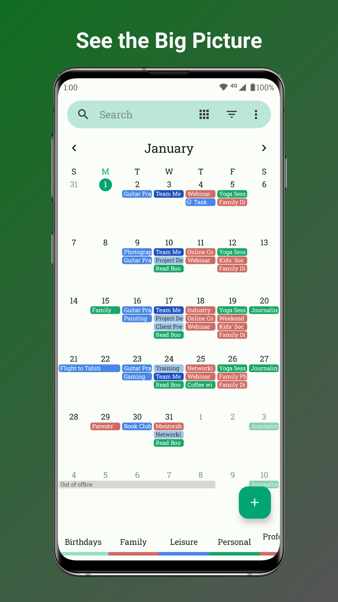
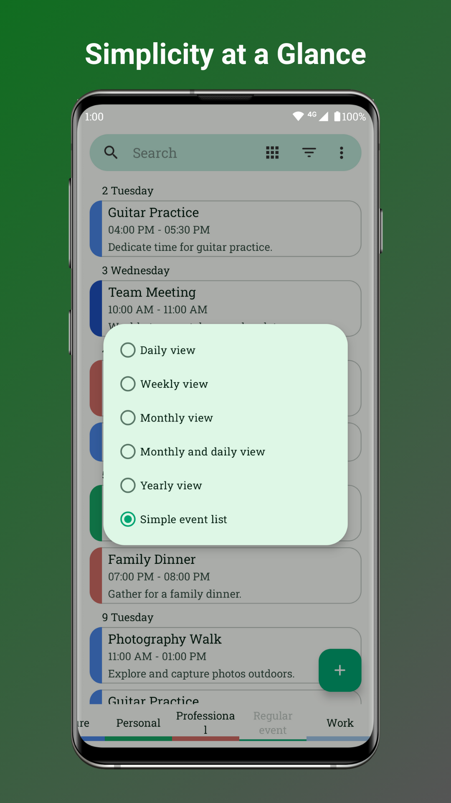
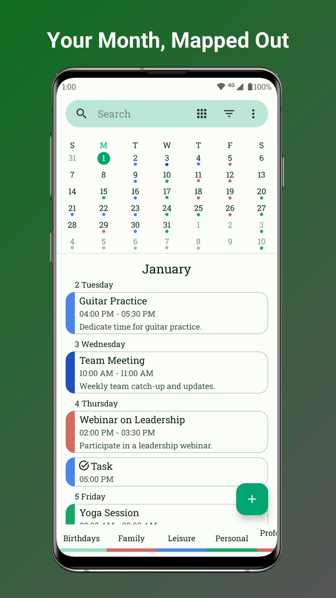

# Fossify Calendar

  

Your Private & Powerful Schedule Planner

Tired of cluttered calendars and privacy concerns?

Fossify Calendar is here to change that. Your open-source powerhouse for managing life, designed with privacy as its core and packed with powerful features to keep you organized.

Here's what makes Fossify Calendar different:

**🚫 AD-FREE AND PRIVATE:**  
Your events remain yours. No ads, no tracking, no intrusive permissions.

**⏰ FLEXIBLE AND CUSTOMIZABLE:**  
Craft events precisely with times, durations, reminders, and advanced repetition rules.

**🔄 SEAMLESS SYNCING:**  
Sync effortlessly with Google Calendar, Outlook, Nextcloud, Exchange, and more.

**🎨 PERSONALIZE YOUR PLANNER:**  
Set custom sounds, looping audio streams, vibrations, and themes to match your preferences.

**🌈 VIBRANT WIDGETS:**  
Brighten your day with beautiful calendar widgets and themes for your home screen.

**📅 EFFORTLESS DAY MANAGEMENT:**  
Plan your day with ease, whether you're a busy professional or a family organizer.

**🎉 IMPORT CELEBRATIONS:**  
Never miss a birthday or anniversary! Easily import holidays and special dates.

**🔍 FILTER VIEWS:**  
Quickly find what you're looking for with event filters.

**📆 MULTIPLE VIEWS:**  
Switch between daily, weekly, monthly, yearly, and event views effortlessly.

**✨ MATERIAL DESIGN ELEGANCE:**  
Enjoy an intuitive and user-friendly interface with dynamic themes.

**Plus, Fossify Calendar is open-source!**

Join the vibrant community on GitHub, contribute to the project, and make it uniquely yours.

Download Fossify Calendar now and experience the power of a private and customizable schedule.

➡️ Explore more Fossify apps: https://www.fossify.org 
➡️ Open-Source Code: https://www.github.com/FossifyOrg 
➡️ Join the community on Reddit: https://www.reddit.com/r/Fossify 
➡️ Connect on Telegram: https://t.me/Fossify

